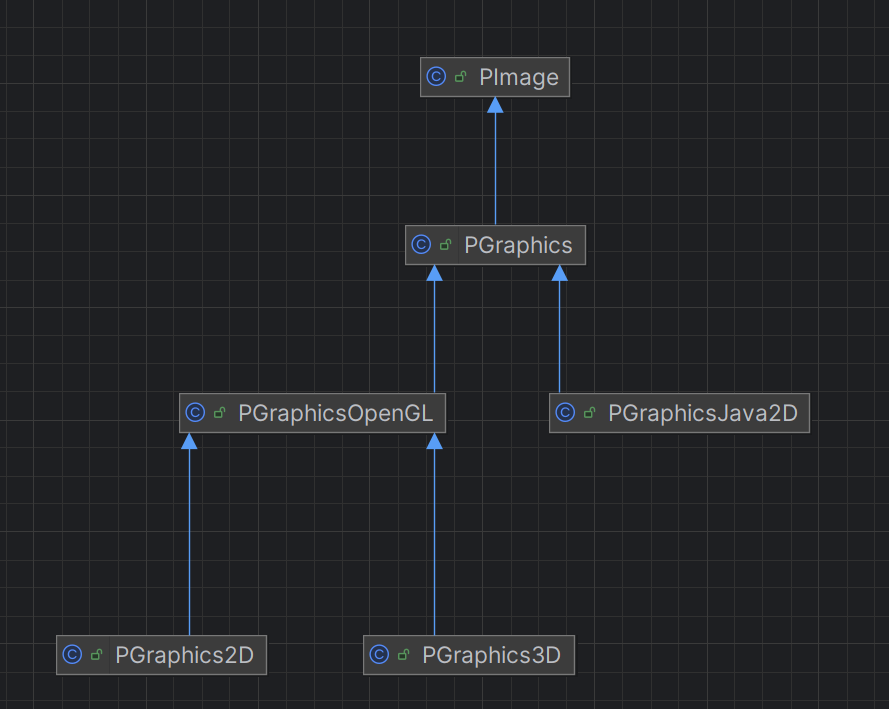
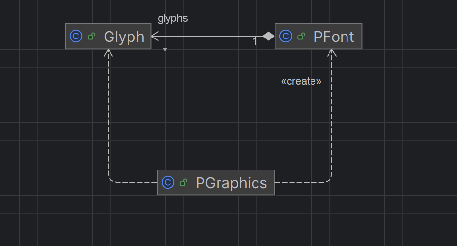

# Software design

## Dependencies

## Patterns
The following section will explain four different design patterns: one creational pattern, two structural patterns, and one behavioral pattern. For each of them, there will be: an introduction of the involved classes for giving a general context, the problem that they solve, their drawbacks and advantages, and a diagram that shows the class relationships. 

## Builder pattern
Builder is a creational design pattern that allows to construct complex objects step by step. It is used in the `PdePreprocessor.java` (*java/src/processing/mode/java/preproc/PdePreprocessor.java*) file, whose responsibility is to handle the process that transforms the sketch tabs, which are written in the processing language, into a single .Java file, that will be used to be compiled. This class, for handling correctly this process has seven parameters, this means that its constructor should accept seven parameters as input, which most of them are always used with their default values. This situation is not good because who uses this class should inserted every time all the parameters, increasing the possibility of generating an error. For this reason, the **PdePreprocessorBuilder** class is introduced in the same file, whose constructor method accepts only the sketch name. The other attributes are initially set to empty using the **Optional** class and then they can be customized by using the setters implemented in the builder class. It is also implemented the fluent interface because each builder's setter returns itself, allowing the method chaining. Once the object is set correctly, the *build()* method is called, which defines the default values for those parameters that are empty and then calls the constructor of the **PdePreprocessing** class to create the final object.
    
A potential problem of this pattern is that until the *build()* method is not called, there is not an usable object from the client side. So, if it is called in this situation, an error will arise. In addition, if once that the object is built, it can be still editable, other setters are needed also in the **PdePreprocessorBuilder** class, increasing significantly the number of lines of code. As alternative, a parameter object can be used. This solves the inconsistency present before calling the *build()* method but it simply shifts the problem of inserting seven parameters from the **PdePreprocessing** class to the new parameter class. So, since the attributes once they are defined in the final object are immutable, the builder pattern is acceptable.
  
  

## Composite pattern
Composite is a structural design pattern that allows to compose objects into tree structures and then work with these structures as if they were individual objects. This pattern is used inside the `TextTransform.java` (*java/src/processing/mode/java/preproc/TextTransform.java*) file, whose responsibility is to modify the content of strings. It contains an **Edit** class, that has all the supported operations (insert a new string, delete a substring, move a substring, and replace a substring with another one), and an **OffsetMapper** interface, which is used to have a bidirectional association between an offset of the input string and an offset of the output string. An offset is a way to keep track of character position, which simply consists in enumerates each of them present in the string starting from zero.
  
The offset-mapping creates an link between the code written by the user and the one that will be executed that can be used for many functionalities. For example, if during the Java code analysis an error arises, its position is tracked using the offset of the output code. Without this mapping this would be a problem since the user works with the processing code and not with the Java code. The preprocessing phase is made up by many steps, which means that firstly the user source code is edited, then another sequence of edits are performed on this intermediate code, and so on until the Java code is ready. So, the conversion between input code and output code is not direct but requires to know each step what they did. This is a problem because it is not possible to know in advance how many steps will be needed. The composite pattern is used to solve this problematic situation, in which the **OffsetMapper** interface is implemented by the **SimpleOffsetMapper** class, which has the leaf role, and by the **CompositeOffsetMapper** class, which has the composite role. As a result, a composite mapper can contain either another composite object or the leaf object, enabling nested coordinate mapping. These classes are used inside the `PreprocService.java` (*java/src/processing/mode/java/PreprocService.java*) file to apply edits to the tabs code in order to pass from processing language to Java. 
  
The advantages of using this pattern are: extensibility, because it supports the possibility of adding or removing a new step in the preprocessing phase without creating huge changes to the mapper, and simplicity, because all the nested mapping are handled by one single method. The downside is that it is more difficult to understand how many nested mappers are active during code execution. There are not alternative for this situation but however there are more benefits than drawback.
  
  
(The *TextTransform* class is not present since it is used by other components)
   
## Template pattern
Template is a behavioral design pattern that defines the skeleton of an algorithm in the superclass but allows subclasses override specific steps of the algorithm without changing its structure. This pattern is implemented inside the following files: `PGraphics.java` (*core/src/processing/core/PGraphics.java*), `PGraphicsJava2D.java` (*core/src/processing/awt*), and `PGraphicsOpenGL.java` (*core/src/processing/opengl/PGraphicsOpenGL.java*). 

The `PGraphics.java` file is a class whose responsibility is to draw visual elements defined in the sketch: shapes, texts and images. It extends the **PImage** class, that handles the image representation, because the sketch elements are shown as they were images. It contains the logic for handling the graphics state, such as the current font, but, some methods are not implemented, such as *beginDraw()* and *endDraw()*, which are used to handle the lifecycle of a set of visual elements. The classes that extend and implement these methods of **PGraphics** are: **PGraphicsJava2D**, which represents the default 2D graphic engine based on the CPU, and **PGraphicsOpenGL**, which contains the settings for a graphic engine GPU based, supporting the 2D and 3D modes. The classes in `PGraphics2D.java` (*core/src/processing/opengl/PGraphics2D.java*) and `PGraphics3D.java` (*core/src/processing/opengl/PGraphics3D.java*) files extend **PGraphicsOpenGL**, defining the type of visual representation. 
  
So, the template method pattern is implemented in this way: with **PGraphics** as the abstract class, and **PGraphicsJava2D** and **PGraphicsOpenGL** as concrete classes. Differently from the definition of template pattern given by the *Gang of four*, **PGraphics** is a concrete class and not an abstract class. This is not properly correct since gives the possibility to instantiate separately an **PGraphics** object, which is useless because it doesn't have implemented its important methods. So, it would have been better use an abstract class. However, the usage of the pattern is very useful because it allows to not have a duplicated central core, which is the management of the graphic states, in the **PGraphics** class, and to have different ways to handle graphic representations in separate classes (**PGraphicsJava2D** and **PGraphicsOpenGL**). Moreover, it also gives the possibility to the user to choose between different graphic engines for his sketches. A possible alternative could be using the strategy pattern, but the problem is that each class should duplicate the core logic, that is big in this case, causing problem of maintainability.

  
The diagram shows the classes that implement the template pattern (**PGraphics**, **PGraphicsJava2D** and **PGraphicsOpenGL**) and the others that complete the context about the graphic engine. The methods are not present for a sake of space, since there are too many.
  
## Flyweight pattern
Flyweight is a structural design pattern that lets you fit more objects into the available amount of RAM by sharing common parts of state between multiple objects instead of keeping all of the data in each object. The classes that implement this pattern are: `PFont.java` (*core/src/processing/core/PFont.java*) and `PGraphics.java` (*core/src/processing/core/PGraphics.java*). The **PFont** class is an object delegated to the management, storage and manipulation of fonts. It represents the collection of characters that belong to a specific font (like Arial Bold size 20). Inside `PFont.java` file there is also the **Glyph** class, whose objects are the graphical representation of a single character with a specific font. The **PGraphics** class has some methods that return an object with all the needed attributes for displaying the characters. This final object contains the attributes of the **Glyph** object plus other such color and positon.   

This is how the flyweight pattern is implemented. The **PFont** object has an array of **Glyph** that contains all the possible glyphs for a certain font. When a new font is loaded, also all its glyphs are loaded, making them immediately available for being used in a sketch. When the **PGraphics** class has to display a character with a certain font, it calls the **PFont** method *getGlyph()*, which returns a **Glyph**. Then **PGraphics** uses the **Glyph** attributes, such as its image, and combines them with other ones, such as color and position, in order to create the final object that will be displayed.

The pattern solves the problem related to the evitable waist of RAM due to attribute duplications (like the character image) for representing the same character of the same font multiple times. In fact without it, for each character a new **Glyph** object would be created. Instead with this pattern, whenever the same character with the same font is used, only its extrinsic state, such as color and position, is duplicated, while its intrinsic state, like the character image, is reused, saving a lot of space in the RAM.

The advantages of using this pattern are the saving of RAM space and the increasing of the performance, while the drawback is that the internal state of the **Glyph** must be immutable since is referred by multiple objects, but this is not a problem in this situation. So, the advantages are much more relevant of the drawbacks, making it a good choice.
  
  
The methods are not present for a sake of space, since there are too many.