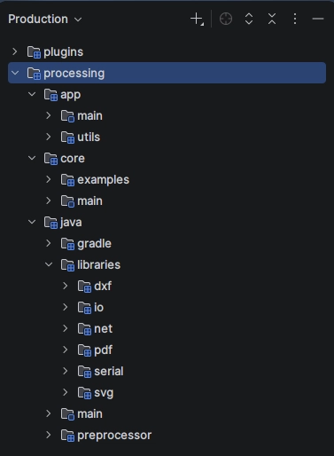
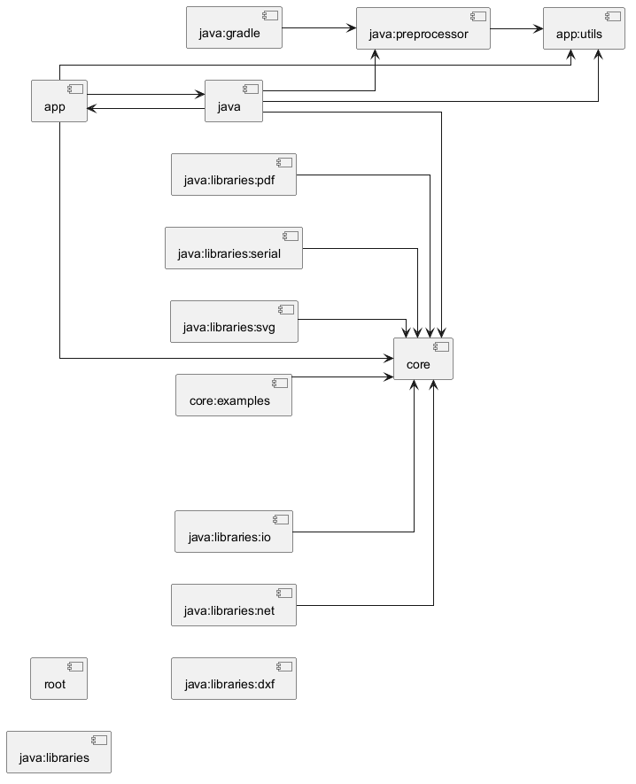

# Software design

## **Dependencies**

This section evaluates the **dependency structure** of Processing, through two complementary methodologies: static import analysis, which maps code-level dependencies and computes stability metrics via fan-in and fan-out, and co-change analysis, which mines the Git commit history to reveal knowledge-level coupling. Together, these perspectives allow us to identify architectural inconsistencies and potential design weaknesses.

### Code Dependencies: Import-based Analysis

This analysis follows the Stable Dependency Principle (SDP), which states that dependencies should point in the direction of increasing stability. A module is considered stable if it has significantly more incoming dependencies than outgoing ones, meaning many other modules rely on it while it relies on few. 

***Method:** Generate dependency graph and count fan-in and fan-out for each module, then calculate instability metric I.*

> Ask the professor if it’s ok using dependencies between modules instead of file imports / usages.

***Tools**: Diagram is generated by extracting internal Gradle module dependencies from project references, converting them into a PlantUML graph, and rendering it.*

**Instability Metric formula:**

$$
I=\frac{F_{out}}{F_{in}+F_{out}}
$$

$F_{out}= outgoing\ dependencies\ (imports)$

$F_{in}= incoming\ dependencies\ (usages)$

$I = 0 \rightarrow max\ stability$

$I = 1 \rightarrow max\ instability$

#### processing.core

$F_{out} = 0$

$F_{in} = 8$

$I = 0$

`processing.core` is the **most stable** module in the codebase, and was deliberately designed as a self-contained runtime kernel, isolated from IDE concerns, build tooling, and language-mode specifics. 

Any modification to this module has the highest potential blast radius in the codebase, which further justifies treating it as a frozen, stable component.

#### processing.app

$F_{out} = 3$

$F_{in} = 1$

$I = 0.75$

`processing.app` is the orchestration layer and contains the central classes of the Processing IDE, as well as it coordinates the UI. 

The most significant finding for this module is the bidirectional relationship with `java`: the two modules form a **dependency cycle**, directly violating the Acyclic Dependencies Principle (ADP). Neither module can be built, tested, or released independently of the other. Furthermore, the instability value of 0.75 is architecturally concerning for a module that is meant to serve as the application's core orchestrator.

#### processing.mode.java

$F_{out} = 3$

$F_{in} = 1$

$I = 0.75$

Referred to as `java` in the Gradle module graph, and as `processing.mode.java` by its Java package structure, this is the Java language mode of Processing, responsible for compiling, running, and debugging sketches written in the Processing/Java dialect.

As a pluggable language mode sitting at the outermost boundary of the system, a high instability is expected and desirable. However, the **bidirectional dependency with `app`** undermines this design intent: a true plugin should depend on `app` but not be depended upon by it. This suggests that responsibilities have not been properly abstracted, forcing `app` to reach into `java` directly instead of programming exclusively to the `Mode` abstraction.

### **Files with MOST Dependencies**

| **File** | **Module** | **Total Imports** | **Internal Module Dependencies** | **Why** |
| --- | --- | --- | --- | --- |
| `app/src/processing/app/ui/Toolkit.java` | `app.ui` | 57 | 4 | Centralizes UI utilities, fonts, images, menu shortcuts, platform behavior, and core Processing helpers |
| `java/src/processing/mode/java/lsp/PdeAdapter.java` | `java.lsp` | 43 | 3 | Adapts PDE concepts to language-server concepts—touches both IDE and Java mode APIs |
| `app/src/processing/app/ui/PDEWelcome.kt` | `app.ui` | 42 | 2 | Compose UI screen importing many UI components and app-level helpers |
| `app/src/processing/app/ui/ExamplesFrame.java` | `app.ui` | 41 | 4 | Combines Swing UI, examples metadata, contribution data, and core Processing classes |
| `java/src/processing/mode/java/JavaEditor.java` | `java.mode` | 37 | **9** | One of the most central coordination classes for Java mode |

**Why they are high:** These are **orchestration/coordination classes** that coordinate between UI, build systems, execution, core APIs, and user workflows. High dependencies are expected here.

#### **Files with LEAST Dependencies**

Many files have **zero explicit imports**:

| **File** | **Module** | **Reason** |
| --- | --- | --- |
| `app/src/processing/app/RunnerListener.java` | `app.main` | Small interface-like class |
| `app/src/processing/app/SketchException.java` | `app.main` | Simple domain exception |
| `core/src/processing/core/PMatrix.java` | `core.core` | Core interface/base abstraction |
| `core/src/processing/core/PMatrix2D.java` | `core.core` | Mathematical core type |
| `core/src/processing/event/Event.java` | `core.event` | Base event abstraction |

**Why they are low:** Simple data types, interfaces, exceptions, and base abstractions. Low-level abstractions should not need to know much about the rest of the system.

### Knowledge Dependencies: Co-change Analysis

This analysis follows the **Logical Coupling** principle, which highlights how files that are frequently modified together in the same commit are likely to share a hidden dependency, regardless of whether a formal structural link exists between them. Also, files that frequently co-change with unrelated modules are candidates for SRP violations.

>Ask the professor if I can use Jaccard index even though we didn’t mention it.

***Method**:* 

1. *Git-logged the latest 1000 commits of the repository*
2. *Filtered files to consider only Production files (that means build files, resources, CI config and other similar files were excluded)*
3. *Counted co-change frequency of files changed together in the same commit*
4. Obtained, for each pair of files:
    1. Number of commits where both files appear together
    2. Jaccard index = $\frac{commits_{fileA+fileB}}{commits_{fileA} + commits_{fileB}}$ 
5. Ranked the top 10 most frequently co-changed file pairs. 

| **#** | **File A** | **File B** | **Co-changes** | **Jaccard** | **Consistent with static dep?** |
| --- | --- | --- | --- | --- | --- |
| 1 | `ui/WelcomeToBeta.kt` | `theme/Locale.kt` | 5 | 0.28 | Yes |
| 2 | `api/Sketch.kt` | `api/Sketchbook.kt` | 4 | 1.00 | Yes |
| 3 | `ui/ContributionManager.kt` | `ui/ContributionPane.kt` | 4 | 0.50 | Yes |
| 4 | `app/Preferences.kt` | `theme/Locale.kt` | 4 | 0.25 | Yes |
| 5 | `app/Base.java` | `app/Preferences.kt` | 4 | 0.14 | Yes |
| 6 | `api/Contributions.kt` | `api/Sketch.kt` | 3 | 0.60 | Yes |
| 7 | `api/Contributions.kt` | `api/Sketchbook.kt` | 3 | 0.60 | Yes |
| 8 | `java/PreprocService.java` | `runner/Runner.java` | 3 | 0.50 | Yes |
| 9 | `app/Schema.kt` | `app/SchemaTest.kt` | 3 | 0.43 | Yes |
| 10 | `app/Preferences.kt` | `theme/Theme.kt` | 3 | 0.27 | Yes |

All top-10 pairs are **within the same module** (`app` or `java`), which is consistent with the declared module boundaries. 

The highest Jaccard score (1.00) belongs to `api/Sketch.kt` ↔ `api/Sketchbook.kt`, meaning these two files have **never been changed independently** — they form a tightly coupled internal unit inside `app`.

#### **Cross-module Co-changes (Those which are not consistent with Static Dependencies)**

Only **two cross-module source pairs** appear to be relevant. 

| **File A (module: `app`)** | **File B (module: `java`)** | **Co-changes** | **Jaccard** |
| --- | --- | --- | --- |
| `app/ui/Editor.java` | `java/JavaEditor.java` | 2 | 0.07 |
| `app/Base.java` | `java/JavaEditor.java` | 2 | 0.06 |

These pairs sit across the **bidirectional dependency** between `app` and `java` visible in the diagram. 

## **Patterns**
The following section will explain four different design patterns: one creational pattern, two structural patterns, and one behavioral pattern. For each of them, there will be: an introduction of the involved classes for giving a general context, the problem that they solve, their drawbacks and advantages, and a diagram that shows the class relationships. 

## Builder pattern
Builder is a creational design pattern that allows to construct complex objects step by step. It is used in the `PdePreprocessor.java` (*java/src/processing/mode/java/preproc/PdePreprocessor.java*) file, whose responsibility is to handle the process that transforms the sketch tabs, which are written in the processing language, into a single .Java file, that will be used to be compiled. The original class requires seven constructor parameters, many of which typically use default values, increasing the risk of errors. To address this, a **PdePreprocessorBuilder** class is introduced. Its constructor only requires the sketch name, while other parameters are initialized as empty using **Optional** and can be set through fluent setter methods. Once the object is set correctly, the *build()* method is called, which defines the default values for those parameters that are empty and then calls the constructor of the **PdePreprocessing** class to create the final object.
    
A potential problem of this pattern is that until the *build()* method is not called, there is not an usable object from the client side. So, if it is called in this situation, an error will arise. In addition, if once that the object is built, it can be still editable, other setters are needed also in the **PdePreprocessorBuilder** class, increasing significantly the number of lines of code. As alternative, a parameter object can be used. This solves the inconsistency present before calling the *build()* method but it simply shifts the problem of inserting seven parameters from the **PdePreprocessing** class to the new parameter class. So, since the attributes once they are defined in the final object are immutable, the builder pattern is acceptable.
  
  

## Composite pattern
Composite is a structural design pattern that allows to compose objects into tree structures and then work with these structures as if they were individual objects. This pattern is used inside the `TextTransform.java` (*java/src/processing/mode/java/preproc/TextTransform.java*) file, whose responsibility is to modify the content of strings. Inside the Java class, it is used to manage string transformations through an **Edit** class (supporting insert, delete, move, and replace operations) and an **OffsetMapper** interface, which maps character positions between input and output strings.

This mapping is essential to relate user-written Processing code to the generated Java code, for example to report errors at the correct position. Since preprocessing occurs in multiple sequential steps, the mapping is not direct and must account for each transformation, whose number is not known in advance. The composite pattern is used to solve this problematic situation, in which the **OffsetMapper** interface is implemented by the **SimpleOffsetMapper** class, which has the leaf role, and by the **CompositeOffsetMapper** class, which has the composite role. As a result, a composite mapper can contain either another composite object or the leaf object, enabling nested coordinate mapping. These classes are used inside the `PreprocService.java` (*java/src/processing/mode/java/PreprocService.java*) file to apply edits to the tabs code in order to pass from processing language to Java. 
  
The advantages of using this pattern are: extensibility, because it supports the possibility of adding or removing a new step in the preprocessing phase without creating huge changes to the mapper, and simplicity, because all the nested mapping are handled by one single method. The downside is that it is more difficult to understand how many nested mappers are active during code execution. There are not alternative for this situation but however there are more benefits than drawback.
  
  
(The *TextTransform* class is not present since it is used by other components)
   
## Template pattern
Template is a behavioral design pattern that defines the skeleton of an algorithm in the superclass but allows subclasses override specific steps of the algorithm without changing its structure. This pattern is implemented inside the following files: `PGraphics.java` (*core/src/processing/core/PGraphics.java*), `PGraphicsJava2D.java` (*core/src/processing/awt*), and `PGraphicsOpenGL.java` (*core/src/processing/opengl/PGraphicsOpenGL.java*). 

`PGraphics.java` is responsible for rendering visual elements in a sketch, such as shapes, text, and images. It extends **PImage**, since rendered elements are treated as images, and manages the graphics state (e.g., current font). Some lifecycle methods, such as *beginDraw()* and *endDraw()*, are not implemented in this class. These methods are defined in subclasses: **PGraphicsJava2D** (CPU-based 2D engine) and **PGraphicsOpenGL** (GPU-based engine supporting 2D and 3D). Additionally, `PGraphics2D.java` and `PGraphics3D.java` extend **PGraphicsOpenGL**, specifying the rendering mode.
  
So, the template method pattern is implemented in this way: with **PGraphics** as the abstract class, and **PGraphicsJava2D** and **PGraphicsOpenGL** as concrete classes. Differently from the definition of template pattern given by the *Gang of four*, **PGraphics** is a concrete class and not an abstract class. This is not properly correct since gives the possibility to instantiate separately an **PGraphics** object, which is useless because it doesn't have implemented its important methods. So, it would have been better use an abstract class. However, the usage of the pattern is very useful because it allows to not have a duplicated central core, which is the management of the graphic states, in the **PGraphics** class, and to have different ways to handle graphic representations in separate classes (**PGraphicsJava2D** and **PGraphicsOpenGL**). Moreover, it also gives the possibility to the user to choose between different graphic engines for his sketches. A possible alternative could be using the strategy pattern, but the problem is that each class should duplicate the core logic, that is big in this case, causing problem of maintainability.

  
The diagram shows the classes that implement the template pattern (**PGraphics**, **PGraphicsJava2D** and **PGraphicsOpenGL**) and the others that complete the context about the graphic engine. The methods are not present for a sake of space, since there are too many.
  
## Flyweight pattern
Flyweight is a structural design pattern that lets you fit more objects into the available amount of RAM by sharing common parts of state between multiple objects instead of keeping all of the data in each object. The classes that implement this pattern are: `PFont.java` (*core/src/processing/core/PFont.java*) and `PGraphics.java` (*core/src/processing/core/PGraphics.java*). The **PFont** class is an object delegated to the management, storage and manipulation of fonts. PFont.java represents a font as a collection of characters. It includes the **Glyph** class, which defines the graphical representation of a single character. The **PGraphics** class uses these glyphs to build objects for rendering, adding attributes such as color and position.  

This reflects the Flyweight pattern: a **PFont** stores all glyphs for a font, which are loaded once and reused. When rendering, **PGraphics** retrieves a glyph via *getGlyph()* and combines its intrinsic data (e.g., shape) with extrinsic properties (e.g., color, position) to produce the final visual element.

The pattern solves the problem related to the evitable waist of RAM due to attribute duplications (like the character image) for representing the same character of the same font multiple times. In fact without it, for each character a new **Glyph** object would be created. Instead with this pattern, whenever the same character with the same font is used, only its extrinsic state, such as color and position, is duplicated, while its intrinsic state, like the character image, is reused, saving a lot of space in the RAM.

The advantages of using this pattern are the saving of RAM space and the increasing of the performance, while the drawback is that the internal state of the **Glyph** must be immutable since is referred by multiple objects, but this is not a problem in this situation. So, the advantages are much more relevant of the drawbacks, making it a good choice.
  
  
The methods are not present for a sake of space, since there are too many.

## **Summary**

### Dependencies

#### Code dependencies

The static dependency analysis reveals a well-structured dependency hierarchy anchored by `processing.core`, the only fully stable module ($I=0$), which acts as the shared foundation depended upon by all other modules.

The most critical finding is the **dependency cycle between `processing.app` and `processing.mode.java`**, both sharing an instability value of $I=0.75$. This directly violates the Acyclic Dependencies Principle: neither module can be built, tested, or released independently. The cycle also undermines the plugin architecture intent of the system: `app` exposes a `Mode` abstraction precisely to avoid knowing about specific language modes, yet it maintains a direct dependency back into `java`, suggesting that the abstraction boundary has not been consistently enforced.

At the file level, the highest-dependency classes are orchestration classes whose coupling is architecturally justified by their coordination role. Conversely, the lowest-dependency files are base abstractions and domain primitives, which correctly know nothing about the rest of the system.

#### Knowledge dependencies

At the source level, co-change dependencies in Processing4 are **largely confined within module boundaries**, which means the Gradle module structure is broadly respected in day-to-day development. The most active knowledge clusters are the `app` UI and theme subsystem and the `app` API layer. The only cross-module signals — both involving `JavaEditor.java` and the `app` base layer — directly correspond to the known `app ↔ java` cyclic dependency and reinforce the case for decoupling or formalising the interface between these two modules.
