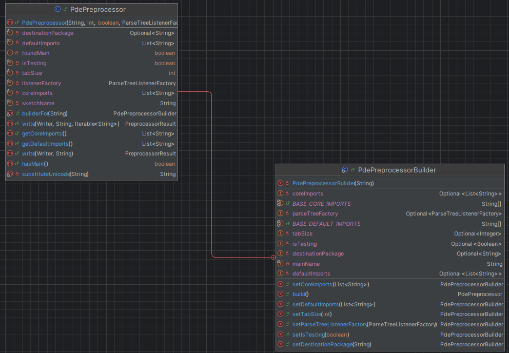
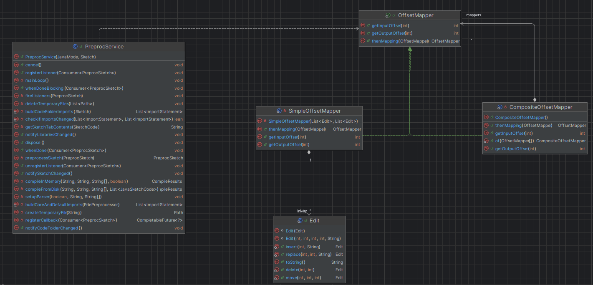

# Software design

## Dependencies

## Patterns
(Introduction)

## Builder pattern
Builder is a creational design pattern that allows to construct complex objects step by step. It is used in the `PdePreprocessing.java` file, whose responsability is to convert the sketch tabs, which are written in the processing language, into a single .java file that will be used to be compiled. This class for handling correctly this process has 7 parameters, this means that its constructor should accept 7 parameters as input, which most of them are always used with their default values. This situation is not good because who uses this class should inserted every time all the parameters, increasing the possibility of generating an error. For this reason, the *PdePreprocessorBuilder* class is introduced in the same file, whose constructor accept only the sketch name. The other attributes are initially set to empty using the *Optional* class and they can be customized by using the setters implemented in the builder class. It also implemented the fluent interface because each builder's setters return itself, allowing the method chaining. Once the object is set correctly, the method *build* is called, which defines the default values for those parameters that are empty and then calls the constructor of the *PdePreprocessing* class to create the final object.
    
A potential problem of this pattern is that until the *build* method is not called, there is not an useble object from the client side. So, if it is called in this situation, an error will arises. In addition, if once that the object is built can be still editable, other setters are needed also in the *PdePreprocessorBuilder* class, increasing significantly the number of lines of code. As alternative, a parameter object can be used. This solves the inconsistency present before calling the *build* method but it simply shifts the problem of inserting seven parameters from the *PdePreprocessing* class to the new parameter class. So, since the attributes once they are defined in the final object are immutable, the builder pattern is accettable.
  

## Composite pattern
Composite is a structural design pattern that allows to compose objects into tree structures and then work with these structures as if they were individual objects. This pattern is used by the `TextTransform.java` class, whose responsability is to modify the content of strings. It contains an *Edit* class, that has all the supported operations (insert a new string, delete a substring, move a substring, and replace a substring with another one), and an *OffsetMapper* interface, which is used to have a bidirectional association between an offset of the input string and an offset of the output string. An offset is a way to keep track of character position, which simply consists in enumerates each of them present in the string starting from zero.
  
The offset-mapping creates an link between the code written by the user and the one that will be executed that can be used for many functionalities. For example, if during the Java code analysis an error arises, it is tracked using the offset of the output code. Without this mapping this is a problem because the user works with the processing code and not with the Java code. The problem is that the preprocessing phase is made up by many steps, which means that firstly the user source code is edited, then another sequence of edits are performed on this intermediate code, and so on until the Java code is ready. So, the conversion between input code and output code is not direct but requires to know each step what it did. This is a problem because it is not possible to know in advance how many steps will be needed. The composite pattern is used to solve this problematic situation, in which the *OffsetMapper* interface is implemented by the *SimpleOffsetMapper* class, which has the leaf role, and by the *CompositeOffsetMapper* class, which has the composite role. As a result, a composite mapper can contain either another composite object or the leaf object, enabling nested coordinate mapping. These classes are used by the `PreprocService.java` class to apply edits to the tabs code in order to pass from processing language to Java. 
  
The advantages of using this pattern are: extensibility, because it supports the possibility of adding or removing a new step in the preprocessing phase without creating huge changes to the mapper, and simplicity, because all the nested mapping are handled by one single method. The downside is that it is more difficult to understand how many nested mappers are active during code execution. There are not alternative for this situation but however there are more benefits than drawback.
  

(The *TextTransform* is not present since it is used by other components)