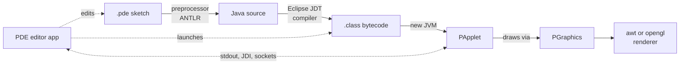

# Overview — Processing

## Purpose and Stakeholders

Processing is a software sketchbook and an associated programming language designed to make creative coding accessible to artists, designers, students, and educators. The project was initiated in 2001 by Ben Fry and Casey Reas, originally at the MIT Media Lab; the Processing Foundation has coordinated development and community since 2012. The current implementation, Processing 4, distributes an integrated development environment (the PDE) together with a graphics and event-handling engine. Users write short programs called *sketches* in a slightly simplified dialect of Java, and Processing transforms each sketch into a standard Java class at build time, so that programs can be compiled and executed without the user having to manage classes, imports, or build configuration. The core graphics library is licensed under LGPL-2.1 so it can be embedded in third-party applications, while the editor and the rest of the tooling are licensed under GPL-2.0. This dual licensing reflects the project's two main roles: being learned and being reused.

The principal stakeholders are:

| Stakeholder | Role |
|---|---|
| **Educators and students** | Use Processing in art, design, computational media, and introductory programming courses. |
| **Artists, designers, and creative coders** | Write sketches for generative art, installations, data visualisation, and rapid prototyping. |
| **Processing Foundation maintainers and contributors** | A small core team plus 219 contributors to the `processing4` repository review changes, manage releases, and preserve API stability across versions. |
| **Library and tool authors** | Extend Processing through the in-IDE Contribution Manager with additional renderers, hardware integrations, and file-format support. |
| **Downstream applications** | Embed the LGPL `core` library (for example PraxisLIVE) as a graphics or sketching backend, independent of the IDE. |

## System Description

Processing is organised as three Java/Kotlin top-level modules with a clear layering. The `core` module is the runtime engine that user sketches link against; `app` is the editor application; and `java` is the plug-in that teaches `app` how to run Java sketches. Running a sketch involves transforming its `.pde` source into a Java class, compiling that class with the Eclipse Java Development Tools, and launching the result in a separate JVM that communicates with the editor through standard streams. This pipeline is the central concern of the `java` module and exercises every other module along the way.

- **`core/`** (~54 K LOC, 5 sub-packages) — the runtime engine. `PApplet` manages each sketch's lifecycle (`setup`, `draw`, event handling) and `PGraphics` defines the abstract drawing operations. Two renderer implementations sit alongside: `awt` provides the default 2D renderer through Java AWT, and `opengl` provides hardware-accelerated 2D and 3D rendering through JOGL. Helper sub-packages `data` and `event` cover tabular/JSON parsing and unified input events. `core` has no dependencies on the rest of the codebase and is the artefact downstream applications embed.
- **`app/`** (~29 K LOC, 8 sub-packages) — the Processing Development Environment. It defines the editor window (`Editor`), session controller (`Base`), the syntax-highlighting text area, the console, the Contribution Manager, a Look-and-Feel layer, and a platform-abstraction layer that hides OS differences across macOS, Windows, and Linux. The PDE is designed to be language-agnostic and acquires language-specific behaviour from *mode* plug-ins.
- **`java/`** (~22 K LOC, 5 sub-packages plus nested libraries) — the Java mode, which wires the PDE to actually run Java sketches. Its `preproc` package uses an ANTLR grammar (`Processing.g4`) to translate `.pde` files into Java; `runner` launches each compiled sketch in a separate JVM and pipes its output back to the editor; `debug` connects to that JVM through the Java Debug Interface; `lsp` exposes a Language Server Protocol endpoint for autocompletion and diagnostics; and `tweak` instruments running sketches so that numeric literals can be edited live via sliders. The nested `libraries/` directory bundles six extensions (DXF, SVG, PDF, networking, serial I/O, and Java I/O helpers).

The full production codebase totals roughly 108 K lines of Java and Kotlin across the three modules — close to the course's target size, which allows this analysis to cover Processing in its entirety rather than focusing on a single sub-component. The remaining ~38 K LOC reported by `cloc` consist of build scripts, packaging code, example sketches, and the ANTLR grammar — supporting material rather than the subject of architectural analysis.

## Code Statistics

Statistics below are produced by `cloc` v2.06 on commit `HEAD` (2026-05-23) and cross-referenced against the GitHub REST API for contributor and activity figures.

| Metric | Value |
|---|---|
| Repository | github.com/processing/processing4 |
| Primary languages | Java (102 K LOC) + Kotlin (5.6 K LOC) |
| Java + Kotlin production LOC | ~108 K across 381 files |
| Total LOC, all languages | 146 K across 762 files |
| Top-level modules | 3 (`core`, `app`, `java`) + bundled `libraries` |
| Contributors to `processing4` | 219 |
| Open issues + pull requests | 288 |
| Activity | Latest commit 2026-05-23; multiple PRs merged per week |
| Build system | Gradle Kotlin DSL (active); Ant retained for installer packaging |
| Licensing | LGPL-2.1 (`core`), GPL-2.0 (everything else) |

| Module | Files | LOC (Java + Kotlin) | Sub-packages |
|---|---:|---:|---:|
| `core/` | 71 | 54,368 | 5 |
| `app/` | 155 | 29,431 | 8 |
| `java/` | 131 | 21,767 | 5 |

`core` accounts for slightly over half of the Java/Kotlin production code while occupying the fewest files, reflecting the density of the rendering engine — `PApplet` and the OpenGL renderer in particular. Beyond Java and Kotlin, the repository ships roughly 17 K LOC of UI translation strings, 3 K LOC of Gradle and Ant scripts, 1.5 K LOC of ANTLR grammar defining the Processing language syntax, and 126 example `.pde` sketches that double as documentation. The `processing4` repository itself was created in August 2024 to host the version-4 line; the broader Processing project has accumulated contributions across predecessor repositories for over two decades.
